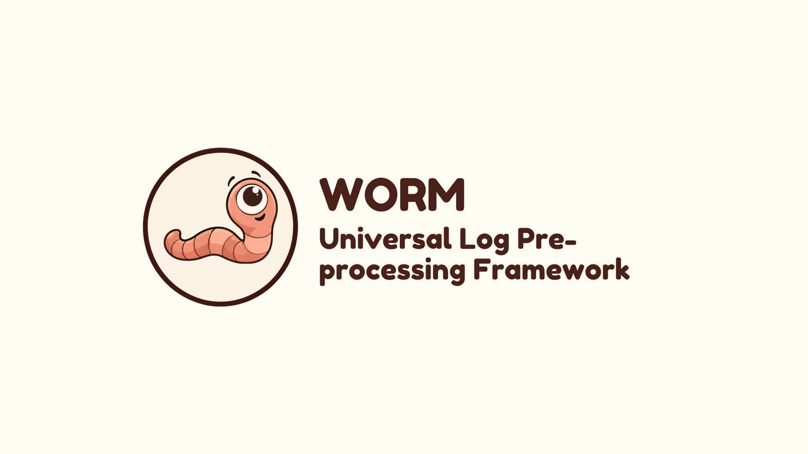

<p align="center">
  
</p>

# WORM — Universal Log Pre-processing Framework

WORM accepts heterogeneous logs, keeps their original bytes in a local SQLite store, and converts recognized records into a versioned, OCSF-based JSON event with a link back to the original. Unknown, malformed, or ambiguous records are quarantined for inspection and replay after a parser pack is updated. This is a log preprocessor, not a SIEM, search engine, or production security boundary.

The project includes a Go CLI/server, an embedded web management UI, YAML parser/source/sink definitions, and a synthetic log generator (`logsim`). It can run on a Linux, macOS, or Windows server directly, in Docker, or without internet access after the binary and its configuration assets have been transferred. See [security guidance](SECURITY.md) before connecting real log sources.

## Demo video

[](https://youtu.be/jXnHJfCAKP0)

Click the thumbnail to watch the full demo on YouTube.

## Get started from source

You need Git, Go 1.25 or newer, and Node.js/npm to **build**. The released CLI does not need Go, Node.js, npm, or a separate SQLite installation at runtime. From a terminal:

```sh
git clone https://github.com/ashokkmt/worm.git
cd worm
npm ci --prefix web
npm run build --prefix web
go build -o worm ./cmd/worm
./worm --version
./worm -syslog-udp none -syslog-tcp none -syslog-tls none -http 127.0.0.1:8080 -ui 127.0.0.1:9090 -inbox none -stdout=false
```

On Windows PowerShell, replace the last three commands with:

```powershell
go build -o worm.exe ./cmd/worm
.\worm.exe --version
.\worm.exe -syslog-udp none -syslog-tcp none -syslog-tls none -http 127.0.0.1:8080 -ui 127.0.0.1:9090 -inbox none -stdout=false
```

In another terminal, open `http://127.0.0.1:9090` for the UI or send a sample event:

```sh
curl -X POST http://127.0.0.1:8080/api/v1/ingest -H 'Content-Type: application/json' --data-binary @testdata/sources/app-custom-json/valid_after.json
```

The raw database defaults to `data/worm.db`; normalized NDJSON defaults to `data/output/normalized.ndjson`. Stop the foreground server with Ctrl+C. `web/dist/` is generated and must be built before compiling the CLI on a fresh clone. A routine local build reports a `dev-<commit>` version; no release-version flag is needed.

For an entirely local, one-shot example without network listeners:

```sh
./worm -file testdata/sources/network-device-firewall/valid_session.log -syslog-udp none -syslog-tcp none -syslog-tls none -http none -ui none -inbox none -stdout=false
```

On Windows, use `.\worm.exe` in place of `./worm`.

## Run a GitHub Release binary

Choose the archive for your OS and CPU from [GitHub Releases](https://github.com/ashokkmt/worm/releases): `worm-vX.Y.Z-linux-amd64.tar.gz`, `linux-arm64`, `darwin-amd64`, `darwin-arm64`, `windows-amd64`, or `windows-arm64`. Download its `SHA256SUMS` too and compare the archive hash before extracting. Each archive includes the binary and `packs/`, `schemas/`, `sources/`, and `sinks/`; keep these directories beside the binary and run from the extracted directory, because configuration paths are relative by default.

On Linux/macOS, for example:

```sh
mkdir worm-release
tar -xzf worm-vX.Y.Z-linux-amd64.tar.gz -C worm-release
cd worm-release
./worm --version
./worm -syslog-udp none -syslog-tcp none -syslog-tls none -http 127.0.0.1:8080 -ui 127.0.0.1:9090 -inbox none -stdout=false
```

Replace `vX.Y.Z` and the platform suffix with the asset you downloaded. On macOS use `darwin-*`. On Windows PowerShell:

```powershell
New-Item -ItemType Directory -Force worm-release | Out-Null
tar -xzf .\worm-vX.Y.Z-windows-amd64.tar.gz -C .\worm-release
Set-Location .\worm-release
.\worm.exe --version
.\worm.exe -syslog-udp none -syslog-tcp none -syslog-tls none -http 127.0.0.1:8080 -ui 127.0.0.1:9090 -inbox none -stdout=false
```

The UI is embedded in the binary. Cloud, Kafka, and external output integrations still need their respective services and credentials when enabled. For building your own tagged six-platform archives, see [`scripts/build-release.sh`](scripts/build-release.sh) and [`scripts/build-release.ps1`](scripts/build-release.ps1).

## What WORM handles

| Area | Current capability |
|---|---|
| Intake | Syslog UDP/TCP/TLS; HTTP POST; a watched file inbox; one-shot `-file`; piped stdin; declarative cloud REST pull and Kafka input. UDP is best effort; TLS, cloud, and Kafka require their own configuration/services. |
| Formats | Syslog, JSON, XML, CSV, CEF, LEEF, and proprietary/application text via YAML parser packs. Syslog can wrap another supported payload format. |
| Source packs | Included examples cover firewalls and other network devices, Linux auth, web access, applications, database audit, cloud audit, containers, endpoint IDS, IAM, IoT, and proprietary appliances. A pack provides source matching, extraction, typing, and normalization rules; a new source using an existing decoder can be onboarded without recompiling. |
| Processing | Original bytes and SHA-256 receipt, format detection, pack matching, OCSF-based normalization, `unmapped` source fields, quarantine and replay, raw/event lineage, and lifecycle counters. |
| Output | Stdout and NDJSON file by default; configurable HTTP SIEM, Kafka, Parquet, and NDJSON sinks through source/sink YAML and a SQLite-backed outbox. External delivery is at least once, so downstream systems should deduplicate by event ID. |

`packs/`, `sources/`, `sinks/`, and `schemas/` in this repository are the configuration examples and validation assets. The browser UI offers event, trace, quarantine, parser-pack, and configuration views; the ingestion HTTP API and the UI/control API use separate listeners.

## CLI commands, formats, and replay

The full, flag-by-flag guide is [CLI.md](CLI.md). It explains every startup argument, default, listener, daemon switch (`-d`, `-status`, `-stop`), verification action, and `packs`/`sources`/`sinks` subcommand. Start with `worm -h` for the binary's own flag list.

The seven current decoder families are **Syslog, JSON, XML, CSV, CEF, LEEF, and declarative proprietary/application text**. Intake transport is separate from decoding: HTTP, a file, Kafka, or stdin can carry a supported format. A decoder parses syntax; a YAML parser pack identifies the source and maps its fields to the normalized event. [CLI.md's format table](CLI.md#decoded-formats) explains each one.

The three YAML directories have distinct jobs: `packs/` say **what a log means**, `sources/` say **where raw logs come from**, and `sinks/` say **where normalized events go**. You can list, inspect, validate, test, apply, and roll back each resource family. [CLI.md](CLI.md#packs-sources-and-sinks) shows the exact syntax and the current live-apply limitations.

Replay is the recovery path for an event WORM accepted but could not normalize. Its original bytes and quarantine reason remain in the database. After you validate and activate a matching pack, replay processes those stored bytes with the current pack without asking the source to resend them:

```sh
worm replay                         # list quarantined records and their IDs
worm packs validate -f new-device.yaml
worm packs test -f new-device.yaml -sample sample.log
worm packs apply -f new-device.yaml
worm replay <quarantine-id>         # if it remains quarantined; or: worm replay all
```

These are example placeholders: the pack must actually match a quarantined event. Pack activation currently also requests bulk replay; check its report before replaying an ID manually. Replay and pack activation need the running management API, and their CLI token handling has a known limitation described in [CLI.md](CLI.md#replay-recover-an-event-after-adding-parser-knowledge) and [SECURITY.md](SECURITY.md). The `-verify` commands compare stored bytes/events to hashes in the same database; they are consistency checks, not independently anchored tamper-proof evidence.

## Docker and simulation

For the full local demo (WORM plus seven synthetic source containers), build the embedded UI and vendor Go dependencies **on the build machine** because the core Dockerfile builds with `GOPROXY=off`:

```sh
npm ci --prefix web
npm run build --prefix web
go mod vendor
docker compose -f docker-compose.yaml up --build
```

Open `http://127.0.0.1:9090`. The Compose file maps ports 1514 UDP/TCP, 8080, and 9090 onto the host; it is a **local demonstration configuration**, not a secure public deployment. Stop with `docker compose -f docker-compose.yaml down`. Docker named volumes retain data after `down`; do not use `down -v` unless you intend to erase it. A fresh Docker build also needs the Go and npm dependencies available or pre-cached on the build machine.

To run WORM natively and only the simulator fleet in Docker, start WORM with `-syslog-udp :1514 -syslog-tcp :1514 -http :8080 -ui :9090 -inbox data/inbox`, then run `docker compose -f simulator.yaml up --build`. That simulator file sends to `host.docker.internal`; it contains seven standard demo sources (firewall, ASA, SSHD, IDS, web server, app, database). Stop with `docker compose -f simulator.yaml down`.

Without Docker, build `logsim` with `go build -o logsim ./cmd/logsim` (Windows: `logsim.exe`) and run a bounded HTTP test while WORM is listening:

```sh
./logsim --source app --scenario normal --format http-post --target http://127.0.0.1:8080/api/v1/ingest --rate 5 --count 50
```

`logsim --source` accepts `firewall`, `asa`, `sshd`, `ids`, `webserver`, `app`, `database`, or `all`; it can emit to stdout, syslog UDP/TCP/TLS, HTTP POST, or files. The data is synthetic, not an enterprise source qualification. For the published measurements and repeatable 10,000-event methods, use [benchmarking.md](benchmarking.md).

## Deployment modes and safety

- **Offline/air-gapped:** transfer a matching Release archive and checksum, extract it with its packs/schemas/source/sink directories, and run only local file/stdin/spool or local network transports. The shipped CLI has no Go/Node runtime dependency or required internet call. Build-time dependencies and any externally configured adapter are separate.
- **Connected/server:** run the binary on a supported host and enable only the required ingress and egress integrations. Place network listeners behind a trusted boundary, provide TLS/authentication at the edge, and back up the SQLite database and output assets.
- **Docker:** use the included image/Compose files for local simulation; adapt mounts, networking, secrets, and permissions before a controlled deployment.

Known authentication, raw-data exposure, and delivery-durability gaps are documented in [SECURITY.md](SECURITY.md). Do not expose the default listeners to an untrusted network or use this prototype as the sole evidence store for critical records.

No license file is currently published. Please obtain maintainer permission before reusing or redistributing this source; maintainers should add their chosen license before inviting external contributions.
